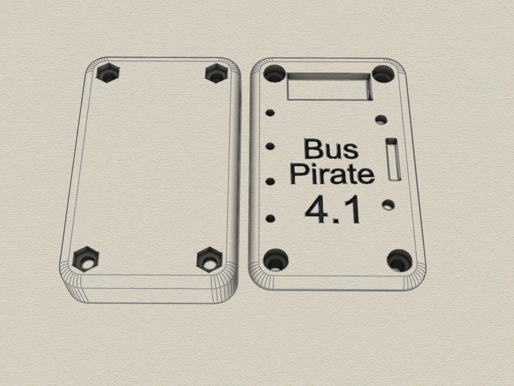
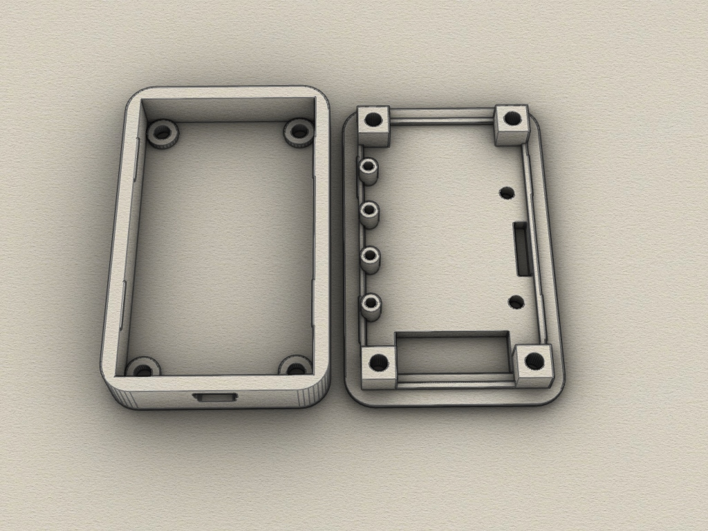
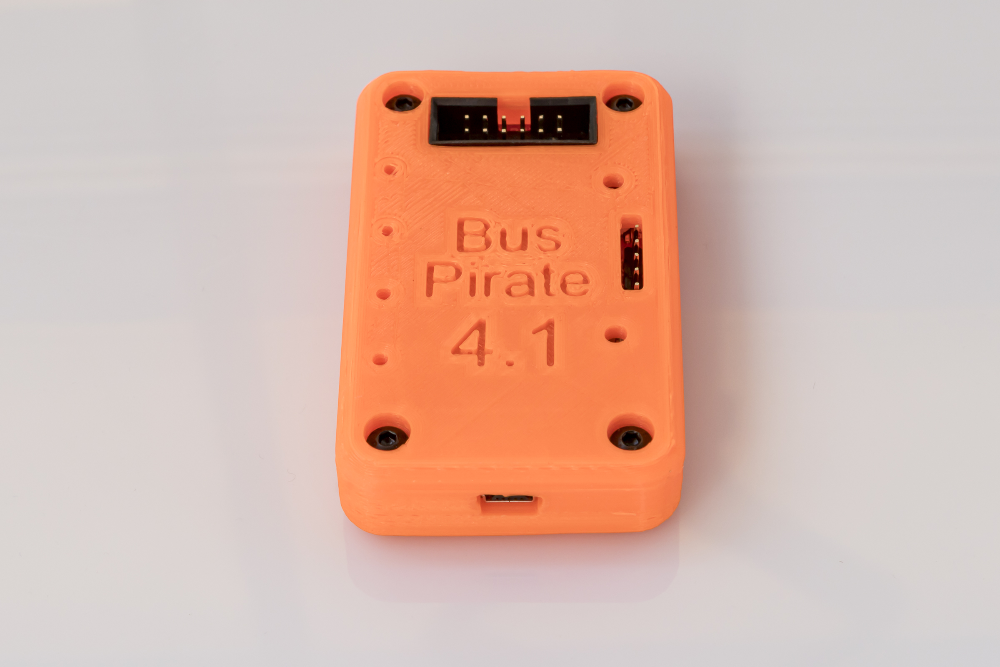
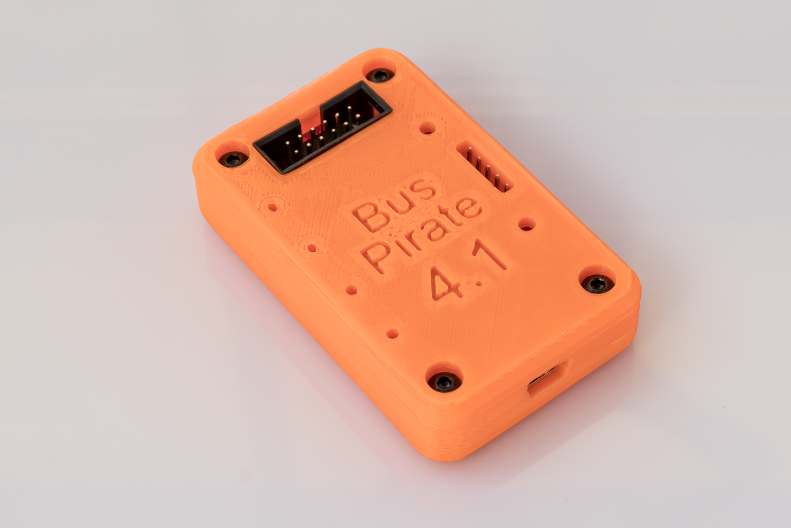
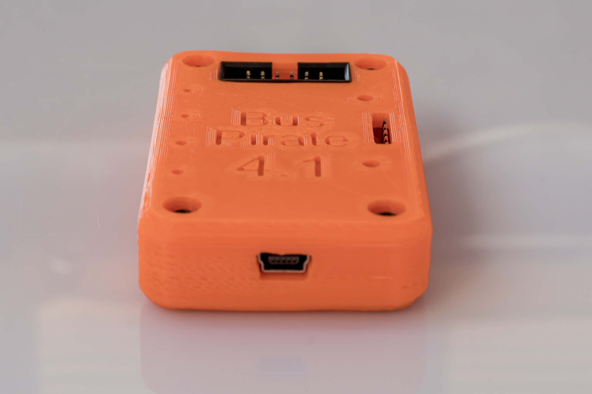
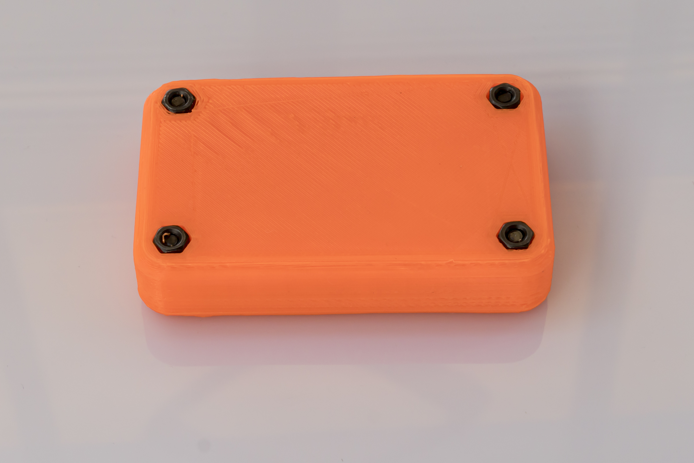
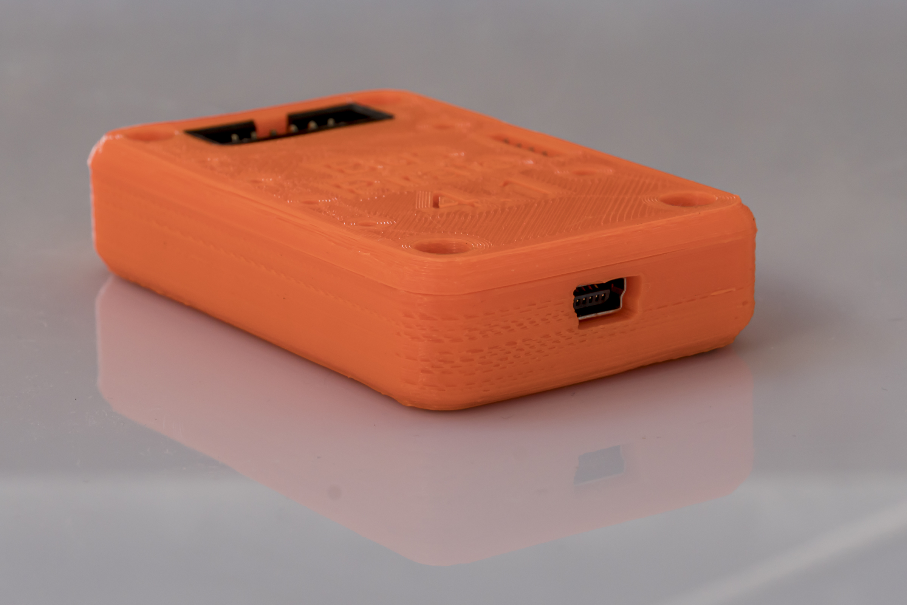

# Bus Pirate 4.1 3D enclosure
3D-printable enclosure for Bus Pirate 4.1 (STL File, Created with Rhino 6) 

## 3D Case

The enclosure consists of 2 parts which are screwed together. 

Requirements:
* 3D printer 
* Filament of your choice
* 4 x 12mm M3 screws

## View

